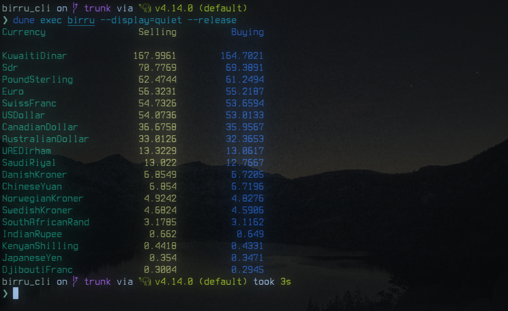

# Birru

A simple CLI tool the gets data from the **Birru API**. Checkout the [Birru Repo](https://github.com/frectonz/birru) for more info.

Built using OCaml 🐫

## Technologies Used

- [Yojson](https://github.com/ocaml-community/yojson)
- [ANSITerminal](https://github.com/Chris00/ANSITerminal)
- [Cohttp](https://github.com/mirage/ocaml-cohttp)
- [Dune](https://github.com/ocaml/dune)
- [Opam](https://opam.ocaml.org/)
- [Ocaml](https://ocaml.org/)
